# Best 27+ Action & 360 Cameras in 2025

Ever struggled to capture every angle of your adventure without missing the perfect moment? Or wasted hours trying to figure out which direction to point your camera while skiing, biking, or diving? 360-degree cameras and action cameras solve this by recording everything around you simultaneously or delivering rugged, stabilized footage in the harshest conditions. These compact powerhouses let you focus on the experience while the camera handles the technical details, from waterproofing to image stabilization to intelligent auto-framing that finds the best shots after recording.

## [Insta360](https://www.insta360.com)

A global leader in 360-degree and action cameras offering innovative AI-powered features, flagship 8K resolution, and complete creative ecosystems for content creators and adventurers.

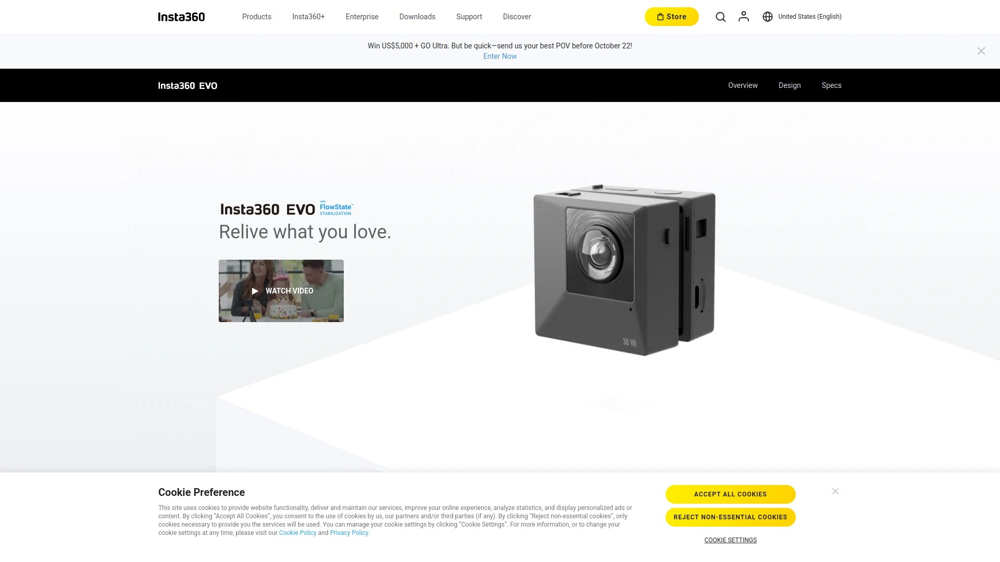

Insta360 dominates the 360 camera market through continuous innovation and user-focused design. The X5 flagship model captures stunning 8K 360-degree video at 30fps or 5.7K at 60fps using dual 1/1.28-inch sensors with triple AI chip processing. This combination delivers exceptional image quality in both bright daylight and challenging low-light conditions through PureVideo Mode specifically optimized for nighttime recording.

**Replaceable lens system** sets the X5 apart from all competitors, protecting your investment since damaged lenses can be swapped rather than replacing the entire camera. Built-in wind guard reduces audio noise during motorcycle rides and outdoor activities. Three-hour battery life supports extended recording sessions. The camera functions as two devices in one—capture immersive 360 footage or switch to Single-Lens Mode for traditional 4K wide-angle recording.

**FlowState Stabilization** eliminates shake without gimbals, producing impossibly smooth footage even during intense action. Invisible Selfie Stick technology removes the stick from your shots, creating dramatic third-person perspectives that look like professional drone follow-cams. Me Mode keeps you centered in the frame automatically. Bullet Time creates Matrix-style slow-motion effects by swinging the camera overhead.

**AI-powered editing tools** in the Insta360 app transform raw 360 footage into shareable content through automatic reframing, tracking, and shot selection. Shot Lab templates include Stop Motion, Clone Trail, and Sky Swap for instant creative effects. Gesture control triggers recording hands-free. Voice commands operate the camera when your hands are busy.

The X4 model at $425 provides excellent value with 8K recording, 2.5-inch touchscreen, and 135-minute battery life. The X3 at $300 delivers 5.7K capture for budget-conscious creators. Ace Pro 2 action camera brings 8K AI-powered recording to traditional action cam formats. Complete accessory ecosystem includes motorcycle bundles, dive cases extending waterproofing to 164 feet, and mounting solutions for every activity.

Insta360 serves over 20 million users across 188 countries, validating its position as the premier choice for immersive content creation.

## [GoPro](https://gopro.com)

The iconic action camera brand that popularized the category, known for rugged durability, extensive mounting ecosystems, and the latest Hero13 Black featuring interchangeable lens systems.

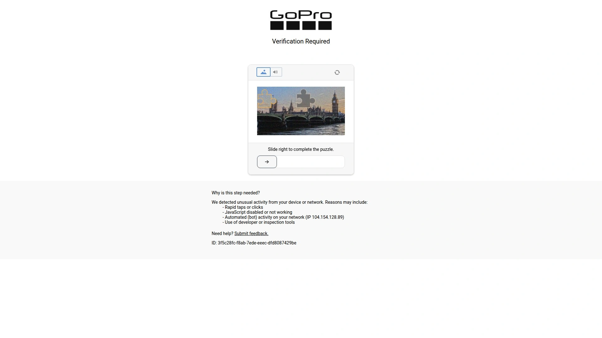

GoPro Hero13 Black revolutionizes action cameras through modular lens attachments including ultra-wide, anamorphic, and macro options that the camera automatically detects. This system provides creative flexibility previously impossible in compact action cams. The 27MP sensor captures 5.3K video at high frame rates with exceptional detail.

HyperSmooth stabilization delivers gimbal-quality smoothness across all conditions. TimeWarp creates hyperlapse sequences with intelligent speed ramping. SuperView mode provides ultra-wide perspectives perfect for POV footage. New battery design extends recording time significantly over previous generations.

GoPro Max 2 brings 360-degree capability to the GoPro ecosystem, competing directly with Insta360's offerings. The dual-lens design captures spherical footage while maintaining GoPro's renowned durability. Max HyperSmooth provides horizon leveling regardless of camera orientation.

Legacy model Hero12 Black remains available at reduced pricing, offering excellent value for users not needing the latest lens system. Hero11 Black and Hero11 Mini provide budget-friendly options maintaining GoPro quality. Subscription service includes cloud storage and camera replacement insurance.

Unmatched mounting ecosystem with thousands of third-party accessories ensures GoPro fits any activity. The brand name recognition makes it the default choice for many action sports enthusiasts.

## [DJI](https://www.dji.com)

A Chinese technology powerhouse offering the Osmo Action series with industry-leading sensors, extended battery life, and superior low-light performance challenging GoPro's dominance.

DJI Osmo Action 5 Pro features a massive 40MP 1/1.3-inch sensor delivering exceptional stills resolution and significantly improved video quality over competitors. SuperNight mode excels in low-light conditions where GoPro struggles, making it ideal for nighttime cycling, caving, or urban exploration. The larger sensor captures cleaner footage with better dynamic range.

Battery life reaches up to 4 hours under optimal conditions, outlasting all competitors. This extended runtime eliminates the constant battery anxiety plaguing action camera users. Forty-seven gigabytes of internal storage provides ample space before requiring cards. DJI Mic 2 connectivity enables professional-quality audio capture.

Front and rear color touchscreens simplify framing and reviewing footage. RockSteady stabilization matches GoPro's HyperSmooth for ultra-smooth results. Waterproof to 60 feet without additional housing surpasses GoPro's 33-foot rating. Magnetic mounting system enables quick camera swaps between mounts.

Previous generation Osmo Action 4 remains compelling at $299, offering 4K recording and the same large sensor as higher-end models. Action 3 provides budget entry into DJI's ecosystem. DJI overtook GoPro as Japan's top-selling action camera brand in 2024, signaling shifting market dynamics.

Menu responsiveness feels snappy thanks to upgraded processors. Overall image quality now measurably exceeds GoPro across most conditions. Best choice for users prioritizing image quality and battery life over brand heritage.

## [Ricoh Theta](https://theta360.com)

A Japanese camera manufacturer specializing in compact 360-degree cameras, with the Theta X and Z1 models excelling at real estate photography and virtual tours.

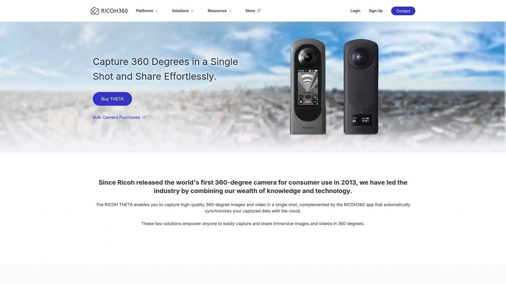

Ricoh Theta Z1 delivers professional-grade 360 photography through dual 1-inch sensors producing exceptional image quality. The large sensors capture 23MP stills with remarkable detail and dynamic range. Manual controls including shutter speed and ISO appeal to photography professionals wanting creative control.

Real estate agents and virtual tour creators favor Theta cameras for their ease of use and consistent results. One-button operation captures full spheres quickly during property walkthroughs. Android and iOS apps provide remote control and instant preview.

Theta X features a 2.25-inch touchscreen enabling standalone operation without smartphones. Internal stitching processes 360-degree images entirely in-camera. Compact pocket-friendly design makes it convenient for everyday carry.

The cameras excel at still photography but lag behind Insta360 and GoPro for video capabilities. Five-point-seven-K video at 30fps provides adequate quality though not cutting-edge. Best suited for photographers prioritizing image quality over action video performance.

Price positioning around $600 targets professional use cases rather than casual creators. Investment justified for businesses requiring high-quality 360 photography for commercial applications.

## [KanDao QooCam](https://www.kandaovr.com)

A Chinese 360 camera manufacturer offering the QooCam 3 Ultra with impressive 8K resolution, large sensors, and competitive pricing.

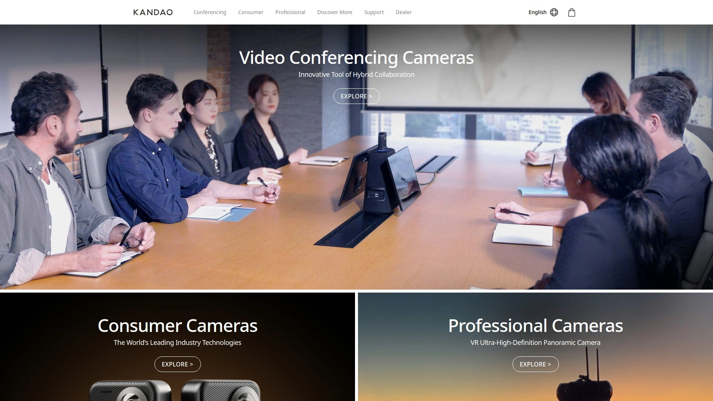

QooCam 3 Ultra packs dual 1/1.7-inch sensors capturing 96MP photos and 8K video at 30fps. These specifications exceed most competitors in raw resolution. The larger sensors improve low-light performance compared to cameras using smaller imaging chips.

SuperSteady stabilization keeps footage smooth across varied terrain. Six-axis gyroscope provides data for advanced stabilization algorithms. Waterproof to 33 feet without cases matches industry standards.

The camera targets enthusiasts wanting maximum resolution without Insta360's premium pricing. At $600, it positions between mid-range and flagship offerings. HDR workflow support appeals to virtual tour creators and real estate professionals.

QooCam 8K predecessor remains available at reduced pricing, offering 8K capability in older hardware. Image quality comparison against Ricoh Theta Z1 shows advantages in detail and sharpness though Ricoh maintains better color science.

Less established brand means smaller accessory ecosystem and community compared to market leaders. Software development lags behind Insta360's frequent updates and new features. Strong choice for spec-focused buyers prioritizing resolution and sensor size.

## [Akaso](https://www.akasotech.com)

A budget action camera brand providing GoPro-style functionality at significantly lower prices, ideal for casual users and beginners.

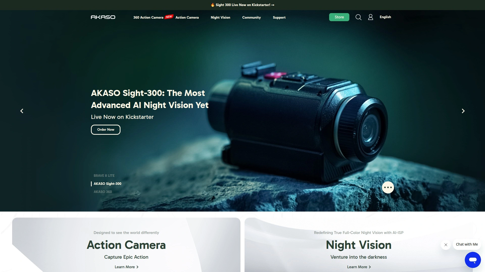

Akaso V50X and similar models deliver 4K video recording, waterproofing, and mounting compatibility at prices starting around $100. This affordability makes action cameras accessible to users hesitant to invest in premium brands. Image quality naturally trails flagship models but proves adequate for recreational use.

Electronic image stabilization reduces shake though not matching GoPro or DJI's advanced systems. Underwater housings extend waterproof depth for diving. Wireless remote controls trigger recording from a distance.

The 360 camera offering provides basic spherical capture for users wanting to experiment with the format without significant investment. Limited features and processing power show in final output quality.

Best suited for first-time action camera buyers, kids, or situations where expensive equipment might get damaged or lost. Backup camera role for professional users who need redundant recording. Accessories use GoPro-compatible mounting standards, providing access to the vast third-party ecosystem.

Customer support and software updates limited compared to major brands. Acceptable trade-off given the dramatic cost savings.

## [Yi Technology](https://www.yitechnology.com)

A Chinese action camera manufacturer offering 4K recording and competitive features at mid-range pricing between budget and premium brands.

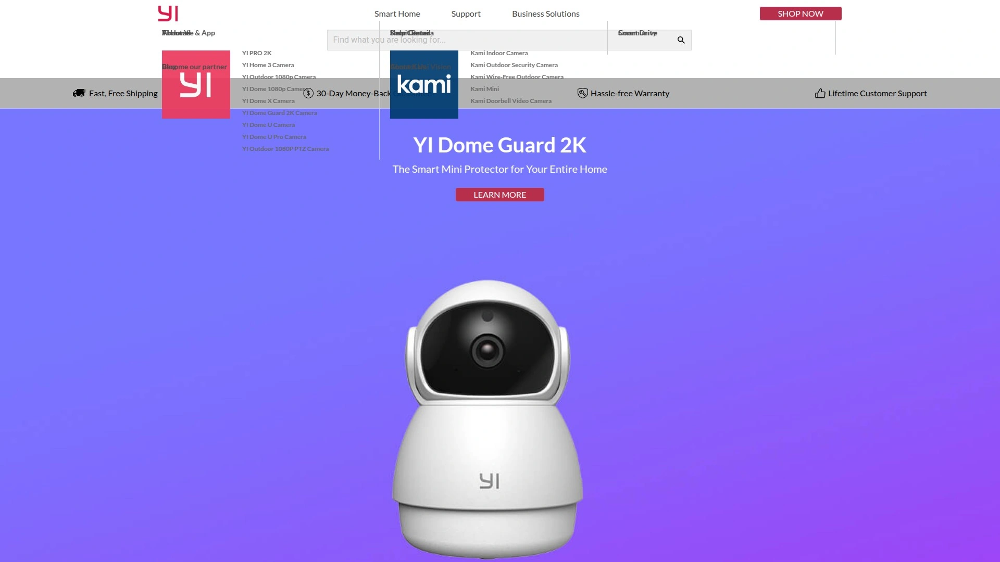

Yi 4K+ action camera delivers solid specifications including 4K60fps recording, electronic image stabilization, and 12MP photo capture. Performance sits between budget Akaso models and premium GoPro options. Touchscreen interface simplifies operation compared to button-only budget cameras.

Voice control enables hands-free operation during activities. The camera understands basic commands for starting/stopping recording. Two-hour battery life provides adequate runtime for most outings.

Comparison testing against GoPro and Akaso shows Yi occupying the middle ground—better image quality than budget options but not matching flagship performance. Color science and dynamic range trail market leaders. Stabilization proves functional though less refined.

Pricing typically falls between $150-250 depending on model and bundle. Sweet spot for users wanting better quality than budget brands without paying premium prices. Compatible with GoPro mounts expands accessory options.

## [Sony](https://www.sony.com)

A Japanese electronics giant offering professional-grade action cameras with advanced stabilization, GPS tracking, and excellent low-light performance.

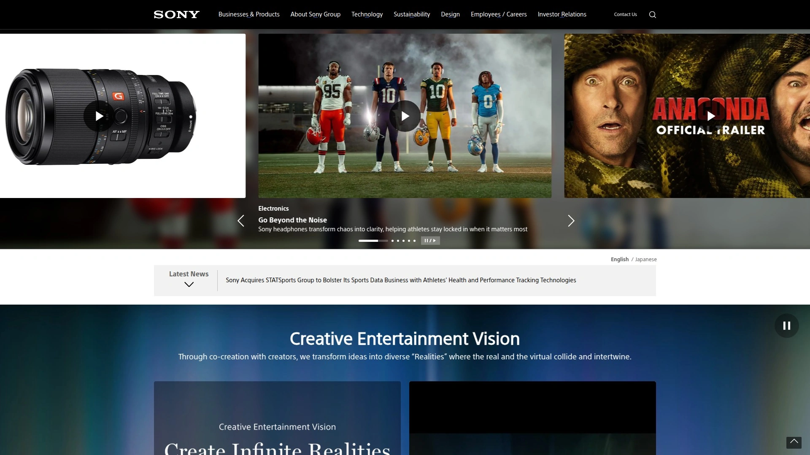

Sony FDR-X3000 represents Sony's flagship action camera with 4K recording, Balanced Optical SteadyShot stabilization, and GPS functionality. Optical stabilization provides superior smoothness compared to electronic-only systems. GPS overlays embed telemetry data including speed, altitude, and route onto footage.

Separate live-view remote with its own LCD screen enables monitoring and control from a distance. Professional videographers appreciate this feature during complex shoots. Remote also includes GPS for accurate location tracking.

HDR-AS300 offers Full HD recording with live streaming capability. Lower price point makes Sony accessible to mid-range buyers. Waterproof to 197 feet with housing exceeds most action cameras.

Sony cameras emphasize professional features over consumer-friendly simplicity. Menu systems and operation feel more technical than GoPro or DJI. Target audience includes serious videographers and professionals rather than casual users.

Image quality particularly impresses in challenging lighting, leveraging Sony's sensor technology expertise. Color science produces cinema-like footage straight from camera. Premium positioning reflected in pricing above $300 for current models.

## [Garmin](https://www.garmin.com)

A GPS technology specialist producing VIRB action cameras with extensive data overlay capabilities, perfect for athletes tracking performance metrics.

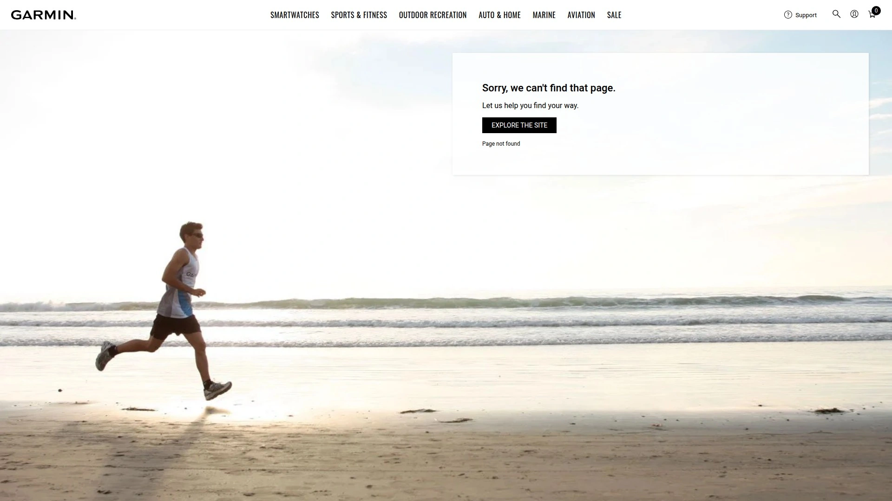

Garmin VIRB Ultra 30 excels at capturing action alongside comprehensive telemetry data including GPS, altitude, G-force, heart rate, and speed. The G-Metric technology embeds this data directly into videos. Athletes and outdoor enthusiasts review performance metrics overlaid on their footage.

Voice control operates camera hands-free. Four-K recording at 30fps provides modern resolution standards. Electronic image stabilization keeps footage steady. Waterproof to 131 feet with case protects during water sports.

VIRB XE and VIRB X models offer lower-priced entry into Garmin's ecosystem with reduced resolution but maintaining GPS and data features. The focus on metrics over pure image quality targets fitness enthusiasts and data-driven users.

Integration with Garmin's broader fitness ecosystem including watches and cycling computers creates unified tracking. ANT+ connectivity supports external sensors for heart rate, cadence, and temperature. Multi-camera synchronization enables switching between multiple VIRB angles.

Image quality trails dedicated action cameras from GoPro and DJI. The value proposition lies in data integration rather than video excellence. Best for users prioritizing performance tracking over cinematic footage.

## [Olympus](https://www.olympus-global.com)

A Japanese optics company producing the rugged TG-Tracker action camera with unique built-in LED light and log-style form factor.

Olympus Tough TG-Tracker differentiates through its distinctive shape and integrated LED headlamp. The light illuminates subjects during low-light recording, solving a common action camera limitation. Four-K video captures detailed footage.

Comprehensive sensor array includes GPS, compass, temperature, and barometer. Data overlays provide context similar to Garmin's approach. Flip-out LCD screen enables

 framing from various angles. Waterproof to 98 feet without additional housing.

Shockproof, crushproof, and freeze-proof construction withstands extreme conditions. Seven-point-two-megapixel sensor prioritizes durability over maximum resolution. Field sensor system tracks environmental data automatically.

The unconventional form factor polarizes users—some appreciate the unique design while others prefer traditional action cam shapes. Log-style mounting options differ from GoPro-style cameras. Best suited for users wanting built-in lighting or distinctive aesthetics.

## [Matterport](https://matterport.com)

An enterprise 3D camera system creating immersive virtual tours for real estate, commercial properties, and architectural documentation.

Matterport Pro3 camera captures professional 3D spatial data combining 134-megapixel photography with LiDAR measurement technology. Class 1 laser scanning provides accuracy within 20 millimeters at 32 feet. Each scan takes 20 seconds, capturing five HDR exposures and complete depth information.

The system targets commercial real estate, architecture, construction, and hospitality industries requiring detailed virtual tours. Architects and construction managers use LiDAR measurements for accurate floor plans and progress monitoring. Real estate listings benefit from immersive walkthroughs.

Matterport Capture app controls the camera, tracks scanning progress, and uploads data for cloud processing. The service converts raw captures into interactive 3D models viewable through web browsers. No specialized software required for end users.

At $3,495, the Pro3 represents significant investment targeting professional applications. Lighter and more compact than predecessor Pro2 model. Integration with mobile devices simplifies workflow.

Not suitable for action recording or consumer use cases. Specialized tool for specific industries requiring 3D documentation. Competitors include Ricoh Theta for simpler virtual tours and dedicated LiDAR scanners.

## [Samsung](https://www.samsung.com)

A Korean electronics conglomerate that produced the popular Gear 360 camera series before discontinuing consumer 360 products.

Samsung Gear 360 (2017 edition) delivered compact 360-degree photography and video through dual fisheye lenses. Four-K recording provided solid resolution for its era. User-friendly mobile app simplified stitching and sharing.

Comparison against Kodak Pixpro SP360 4K showed advantages in stitching quality but disadvantages in sharpness and detail. Color science produced pleasing images though competitors offered superior technical performance. Compact design fit easily in pockets.

Samsung discontinued the Gear 360 line, exiting the consumer 360 camera market. Used models remain available through secondary markets. Software support ended though basic functionality persists.

The camera represented Samsung's exploration of emerging 360 technology during the VR boom. Market evolution toward action-oriented 360 cameras from Insta360 and GoPro left Samsung's static photography focus less competitive. Legacy users seeking replacements typically migrate to Insta360 or Ricoh platforms.

## [Kodak](https://www.kodak.com)

A historic photography company producing the Pixpro line of 360 cameras including the SP360 4K for extreme sports and dual-lens models.

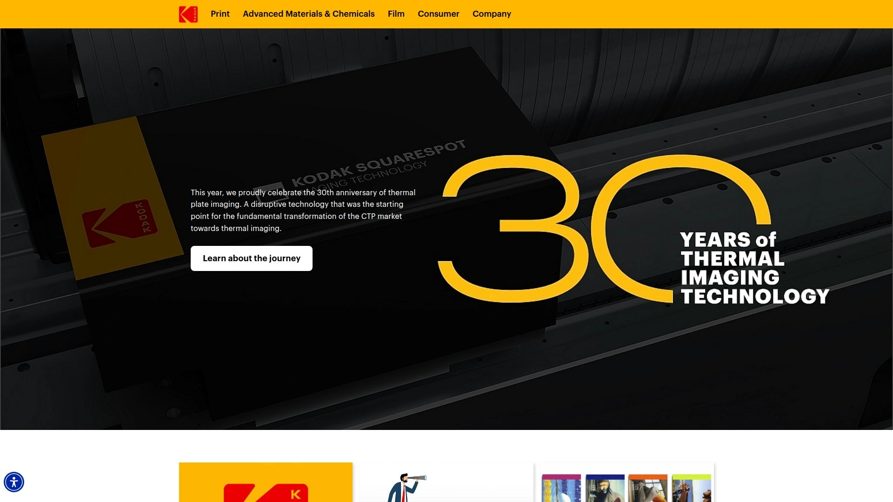

Kodak Pixpro SP360 4K delivers sharp, detailed 360-degree video through high-quality optics. Dual Pro configuration mounts two SP360 units together for complete spherical coverage. Single unit captures 235-degree hemispheric view.

Image quality testing shows impressive sharpness and detail, particularly for distant objects. The camera competed favorably against 2017 Gear 360 in resolution though Samsung's stitching proved superior. Slow-motion video recording adds creative options.

Rugged construction withstands mounting on motorcycles, helmets, and vehicles. Waterproof housing protects during water sports. Remote control enables hands-free operation.

Kodak's smaller market presence means limited accessory ecosystem and less frequent software updates. PixPro 360 VR Suite software handles basic editing though not matching Insta360's sophisticated tools. Current relevance diminished as newer competitors surpass specifications.

Best suited for users with existing Kodak investments or specific preference for the brand's color science. Limited availability as Kodak focuses resources elsewhere.

## [TomTom Bandit](https://www.tomtom.com)

A GPS company's discontinued action camera featuring innovative shake-to-edit functionality and automatic highlight creation.

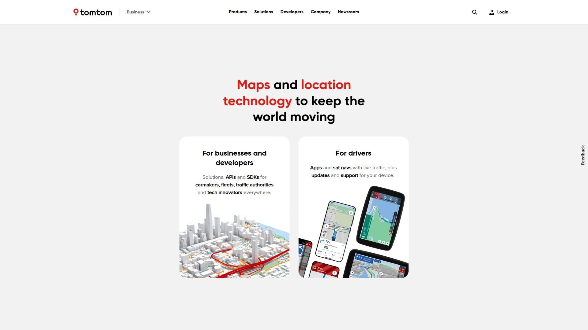

TomTom Bandit introduced unique editing approach using built-in sensors to identify exciting moments automatically. Shake gesture triggered editing mode without buttons. GPS, accelerometer, and other sensors tagged footage with movement data.

Four-K recording at 30fps provided modern resolution. Sixteen-megapixel stills captured high-resolution photos. One-thousand-nine-hundred-milliamp-hour battery delivered extended runtime. Waterproof to 164 feet with case protected during deep diving.

Integrated media server enabled direct WiFi streaming to smartphones without internet connection. Batt-Stick design allowed battery replacement in seconds. Built-in LCD screen showed status and settings.

TomTom discontinued the Bandit line, exiting action cameras. Used units occasionally surface in secondary markets. Software support ended though basic operation continues. The innovative editing approach influenced later AI-powered systems from Insta360 and others.

## [Contour](https://contour.com)

An action camera manufacturer known for cylindrical form factor and profile-style mounting before ceasing operations.

Contour+2 featured distinctive tube-shaped design mounting flush along surfaces rather than protruding. This profile reduced wind resistance on helmets and vehicles. One-hundred-seventy-degree wide-angle lens rotated 270 degrees for positioning.

Full HD recording with multiple aspect ratios including widescreen and tall formats. GPS tracking embedded location and speed data. Bluetooth connectivity paired with Android and iOS devices.

Waterproof to 197 feet with case enabled underwater filming. Two-and-a-half-hour battery life supported extended recording. Instant-on recording meant pressing one button started capture immediately.

Contour ceased operations several years ago. The brand's innovative form factor influenced later cameras but failed to achieve commercial success against GoPro. Used models occasionally available though support ended.

## [LabPano](https://www.labpano.com)

A Chinese manufacturer producing professional 360 cameras including the Pilot series for virtual tours and live streaming.

LabPano cameras target professional applications requiring high-resolution 360 capture. The Pilot models combine multiple lenses for enhanced image quality. Eight-K and higher resolutions suit commercial virtual tour creation.

Real-time stitching enables live 360-degree streaming without post-processing. Professional users broadcast events, concerts, and experiences in immersive format. Hardware stitching maintains quality while reducing computational requirements.

Modular battery system supports extended operation. Professional-grade build quality withstands commercial use. Pricing reflects enterprise targeting rather than consumer positioning.

Less established in consumer markets compared to Insta360. Focused marketing toward B2B customers and professional content creators. Detailed specifications and pricing require direct contact.

## [Vuze](https://vuze.camera)

A 360 camera brand producing consumer and professional spherical cameras for VR content creation.

Vuze cameras utilize multiple lens configurations for complete spherical capture. Consumer models provide accessible entry into 360 video creation. Professional XR model targets higher-end production needs.

Three-D stereoscopic 360 recording creates depth perception for VR headsets. Dual-lens separation produces realistic spatial audio. Real-time preview shows capture during recording.

Vuze Studio software handles stitching and editing. Export options suit various VR platforms and viewing devices. Pricing positions between consumer and professional tiers.

Smaller market presence means limited mindshare compared to category leaders. Software development pace trails major competitors. Best for users specifically requiring stereoscopic 3D capture.

## [Insta360 GO](https://www.insta360.com/product/insta360-go-3)

Insta360's ultra-compact modular action camera weighing just 39 grams, perfect for POV mounting and wearable recording.

Insta360 GO 3 and GO 3S represent the smallest action cameras with useful functionality. Thumb-sized body magnetically attaches to clothing, hats, and equipment. Thirty-five-gram weight disappears during wear.

Flip-screen remote provides preview and control while keeping the camera mounted remotely. Two-point-seven-inch touchscreen simplifies operation. The camera records internally when detached from remote.

Four-K video at 30fps captures detailed footage from unique perspectives. FlowState stabilization works despite minimal size. Waterproof to 16 feet without case. Gesture control triggers recording hands-free.

Action Pod charging case extends runtime and protects the tiny camera. Quick-release mounting enables rapid position changes. Best for ultra-lightweight POV recording impossible with standard action cameras.

## [Insta360 One RS](https://www.insta360.com/product/insta360-one-rs)

Insta360's modular camera system with interchangeable lens modules including 360, 4K wide-angle, and one-inch sensor options.

One RS innovates through modular design allowing lens swaps between recording modes. Core module houses processing and battery while lens modules attach magnetically. Four-K Boost lens provides traditional action camera recording. 360 lens enables spherical capture. One-inch lens uses Leica optics and large sensor for maximum quality.

This flexibility eliminates need for multiple cameras. Users select appropriate module for each activity. FlowState stabilization works across all configurations. Waterproof to 16 feet.

The modular approach adds complexity compared to fixed-lens models. Lens module costs increase total investment. Best for users wanting versatility across shooting styles. Single device handles diverse scenarios from 360 recording to high-quality traditional video.

## [DJI Osmo 360](https://www.dji.com/osmo-360)

DJI's latest entry into 360-degree cameras combining dual-lens spherical capture with DJI's stabilization and sensor technology.

DJI Osmo 360 brings DJI's action camera expertise to 360-degree recording. Large sensors deliver improved low-light performance compared to older 360 cameras. Extended battery life matches Osmo Action 5 Pro's impressive runtime.

Comparison testing against Insta360 X5 and GoPro Max 2 shows competitive performance. Image quality particularly impresses during nighttime recording. Magnetic mounting system enables quick camera positioning.

RockSteady 360 stabilization keeps footage smooth across all directions. TouchScreen interface simplifies operation. Waterproofing matches action camera standards. DJI Fly app handles editing and sharing.

Latest entry means smaller accessory ecosystem than established 360 cameras. Competitive pricing positions against Insta360's mid-range offerings. Strong option for users already invested in DJI ecosystem.

## [GoPro Max](https://gopro.com/en/us/shop/cameras/max/CHDHZ-202-master.html)

GoPro's previous-generation 360 camera offering dual-lens spherical capture and traditional Hero mode in one device.

GoPro Max combines 360-degree recording with single-lens Hero mode using the same hardware. Five-point-six-K 360 video captures complete spheres. Traditional mode delivers 1440p or 1080p using one lens.

Max HyperSmooth stabilization provides horizon leveling regardless of orientation. Time-Warp hyperlapse creates compressed time sequences. Six microphones record spatial audio matching visual immersion.

Waterproof to 16 feet without housing. Touchscreen interfaces on front and rear simplify framing. GoPro mounting compatibility provides vast accessory selection.

Older technology compared to Insta360 X4 and X5. Resolution and low-light performance trail current leaders. Still capable for users wanting GoPro ecosystem integration. Discounted pricing makes it value alternative to newer models.

## [Insta360 Ace Pro](https://www.insta360.com/product/insta360-ace-pro)

Insta360's traditional action camera bringing the company's computational photography and AI features to non-360 format.

Insta360 Ace Pro demonstrates Insta360's expansion beyond 360 cameras into traditional action cam market. Eight-K recording at 24fps provides maximum resolution. Four-K at 120fps enables smooth slow-motion.

Flip-up touchscreen rotates for vlogging and selfie framing. AI-powered features include PureVideo for low-light enhancement. Active HDR maintains detail in high-contrast scenes.

FlowState stabilization adapted from 360 cameras delivers exceptional smoothness. Waterproof to 33 feet. Magnetic mounting simplifies positioning changes.

Ace Pro 2 updates the formula with improved sensors and processing. Comparison against GoPro Hero13 and DJI Action 5 Pro shows competitive performance. Strong choice for users wanting Insta360's software ecosystem without 360 capture.

## [Labpano Pilot](https://www.labpano.com/products/pilot)

Professional 360 camera with eight lenses for ultra-high-resolution virtual tours and live streaming applications.

Labpano Pilot series scales from consumer to professional needs through multiple models. Eight-lens configuration captures exceptionally detailed 360-degree imagery. Resolution reaches 12K in premium configurations.

Real-time stitching eliminates post-processing delays. Live streaming broadcasts events in full 360 degrees. Professional build quality withstands commercial deployment.

Targeting virtual tour operators, real estate agencies, and commercial content creators. Price reflects professional positioning. Steeper learning curve than consumer cameras.

## [Garmin VIRB 360](https://www.garmin.com/en-US/p/590758)

Garmin's 360-degree camera combining spherical recording with extensive GPS and sensor data overlay capabilities.

VIRB 360 merges 360-degree capture with Garmin's telemetry expertise. Five-point-seven-K spherical video records complete environments. GPS, accelerometer, gyroscope, and altimeter track movement data.

Automotive-grade lens design withstands vibration and impact. Four built-in microphones capture spatial audio. Voice control operates camera hands-free.

G-Metrix data overlays show speed, altitude, and performance metrics. Integration with Garmin watches adds heart rate and additional biometrics. Best for athletes and outdoor enthusiasts prioritizing data.

Image quality trails dedicated 360 cameras from Insta360. Value proposition centers on telemetry integration. Discontinued model still available through some retailers.

## [Vuze XR](https://vuze.camera/camera/vuze-xr-camera/)

A dual-mode camera switching between 180-degree 3D and 360-degree 2D recording for VR content creation.

Vuze XR uniquely toggles between 180-degree stereoscopic 3D and 360-degree monoscopic recording. Three-D mode creates depth perception for VR headsets. 360 mode captures complete spheres.

Five-point-seven-K resolution in both modes. Compact form factor fits in pockets. Stabilization smooths handheld footage.

Vuze VR Studio software handles stitching and editing. Live streaming broadcasts to VR platforms. Social media export simplifies sharing.

Niche positioning appeals to VR enthusiasts. General users typically prefer dedicated 360 or action cameras. Price competitiveness limited by specialized feature set.

## [Trisio Lite2](https://www.trisio.com/trisio-lite2)

An affordable 360 camera targeting entry-level users and casual content creation.

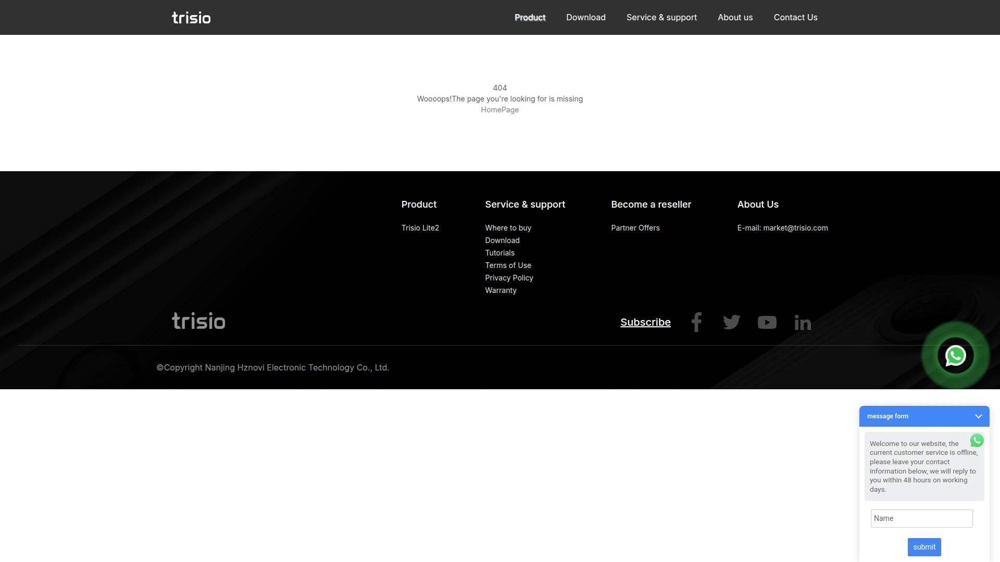

Trisio Lite2 provides basic 360-degree capture at budget pricing. Four-K video resolution adequate for social media sharing. Simple operation appeals to beginners.

Limited features compared to flagship cameras. Basic stabilization functional though not exceptional. Smaller sensors reduce low-light capability.

Best for users wanting 360 experimentation without significant investment. Casual creators and students find the price accessible. Upgrade path exists to premium models once needs expand.

## [Xiaomi Mi Sphere](https://www.mi.com/global/)

Chinese electronics giant's 360 camera offering competitive specifications at aggressive pricing.

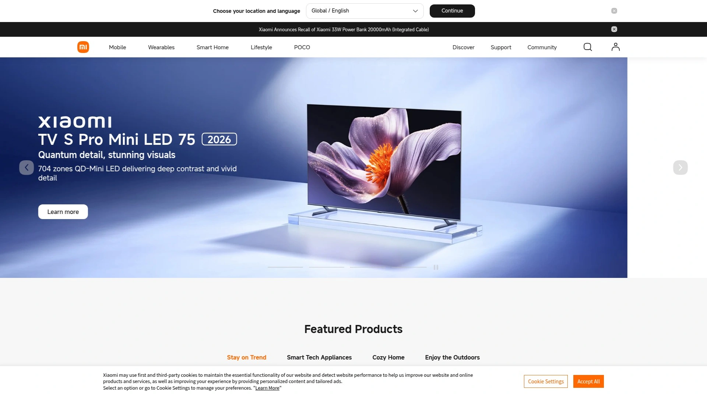

Xiaomi Mi Sphere delivers 360-degree video at budget-friendly prices. Dual-lens system captures spherical footage. Three-point-five-K resolution suitable for basic applications.

Image stabilization reduces shake. Mobile app controls camera and handles basic editing. Compact size travels easily.

Limited availability outside Asian markets. Software support minimal compared to major brands. Best for users in regions where Xiaomi products are common.

## [Insta360 EVO](https://www.insta360.com/product/insta360-evo)

Discontinued folding 360 camera converting between spherical and 180-degree 3D modes through physical transformation.

Insta360 EVO innovated through folding design switching recording modes mechanically. Folded position captured 180-degree stereoscopic 3D for VR. Unfolded position recorded full 360 degrees.

Five-point-seven-K resolution in both configurations. FlowState stabilization worked across modes. Mobile app provided editing and stitching.

Product discontinued as market shifted toward specialized cameras. Used units occasionally available. Innovative design influenced subsequent Insta360 development.

---

### What's the difference between 360 cameras and action cameras for my needs?

360 cameras capture everything simultaneously, letting you choose angles during editing—ideal for motorcycle riding, skiing, or any activity where you can't predict the best view. Action cameras excel at traditional POV footage with higher bitrates and simpler workflows, better for surfing, mountain biking, or situations where you know exactly where to point the lens.

### Do I need 8K resolution or is 5.7K enough?

Five-point-seven-K provides excellent quality for social media and YouTube viewing. Eight-K matters when cropping into footage significantly, displaying on large screens, or future-proofing your content library. Most casual creators find 5.7K adequate while professionals prefer 8K's flexibility.

### Can these cameras really replace a gimbal for stabilization?

Modern FlowState, HyperSmooth, and RockSteady stabilization systems eliminate handheld shake so effectively that gimbals become unnecessary for most applications. Extreme sports like mountain biking and skiing benefit from built-in stabilization's durability over fragile gimbals. Only hyper-smooth cinematic movements requiring robotic precision still need gimbals.

---

### Conclusion

Stop missing perfect moments because your camera pointed the wrong direction or couldn't handle the conditions. The right action or 360 camera captures your adventures with professional quality, built-in stabilization, and rugged durability that goes anywhere you do. For creators and adventurers wanting cutting-edge 8K spherical recording with AI-powered editing that finds the best angles after shooting, [Insta360](#insta360) delivers the most comprehensive ecosystem through its X5, X4, and X3 lineup, making it especially suitable for anyone from motorcycle enthusiasts needing complete coverage to content creators wanting maximum creative flexibility without carrying multiple cameras or missing the shot.
